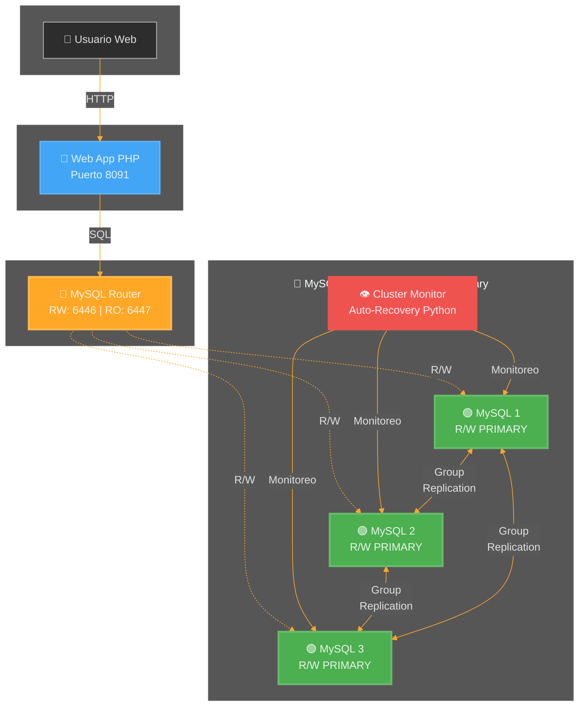

# Sistema de Gestión de Sobretiempos con MySQL InnoDB Cluster

## 📋 Índice de Documentación

> **Documentación Completa del Sistema de Alta Disponibilidad**

### 📚 Guías Principales

1. **[MODO-MULTI-PRIMARY.md](docs/MODO-MULTI-PRIMARY.md)** ⭐ **DESTACADO**
   - **Explicación del modo Multi-Primary**
   - **Todos los nodos pueden leer Y escribir**
   - Comparación Single-Primary vs Multi-Primary
   - Pruebas y verificación

2. **[ARQUITECTURA.md](docs/ARQUITECTURA.md)** 
   - Diagramas del sistema completo
   - Flujos de datos y comunicación
   - Topología del cluster MySQL
   - Visualización de componentes

3. **[CONFIGURACION.md](docs/CONFIGURACION.md)**
   - Parámetros de configuración detallados
   - Cómo ajustar tiempos de verificación
   - Optimización de rendimiento
   - Variables de entorno

4. **[CODIGO.md](docs/CODIGO.md)**
   - Explicación completa del código
   - Función por función
   - Lógica de auto-recovery
   - Scripts de inicialización

5. **[OPERACION.md](docs/OPERACION.md)**
   - Guía de operación diaria
   - Comandos útiles
   - Troubleshooting
   - Pruebas y validación

---

## 🎯 ¿Qué es este Sistema?

Sistema empresarial de **Gestión de Sobretiempos (Horas Extras)** con **Alta Disponibilidad** basado en:

- **MySQL InnoDB Cluster** (3 nodos con Group Replication)
- **MySQL Router** (Proxy inteligente con failover automático)
- **Aplicación Web PHP** (Sistema de registro de sobretiempos)
- **Monitoreo y Auto-Recovery** (Recuperación automática sin intervención humana)



---

## ✨ Características Principales

### 🔄 Alta Disponibilidad
- ✅ **Operación con 1 solo nodo** - No requiere quórum de 2 o 3 nodos
- ✅ **Failover automático** - Cambio instantáneo cuando un nodo falla
- ✅ **Auto-recovery** - Recuperación automática sin intervención manual
- ✅ **Zero downtime** - La aplicación sigue funcionando durante fallos

### 🛡️ Resiliencia
- ✅ **Force quorum automático** - Funciona con cualquier nodo disponible
- ✅ **Auto-rejoin** - Nodos se reintegran automáticamente  
- ✅ **Router dinámico** - Se actualiza según nodos disponibles (state.json)
- ✅ **Reintentos ilimitados** - 2016 intentos de auto-rejoin

### 📊 Monitoreo
- ✅ **Verificación continua** - Cada 10 segundos (configurable)
- ✅ **Detección de fallos** - Inmediata
- ✅ **Logs detallados** - Seguimiento de todo el proceso
- ✅ **Estado del cluster** - Visualización en tiempo real

---

## 🚀 Inicio Rápido

### Requisitos Previos
- Docker Desktop instalado
- PowerShell (Windows) o Bash (Linux/Mac)
- 4GB RAM mínimo
- Puertos disponibles: 6446, 6447, 8091

### Instalación

```bash
# 1. Clonar o descargar el proyecto
cd /ruta/al/proyecto

# 2. Iniciar todos los servicios
docker-compose up -d

# 3. Esperar a que el cluster se inicialice (60-120 segundos)
docker-compose logs -f cluster-setup

# 4. Verificar que todo esté funcionando
docker-compose ps
```

### Acceso

- **Aplicación Web**: http://localhost:8091
- **MySQL Router (RW)**: localhost:6446
- **MySQL Router (RO)**: localhost:6447

---

## 📦 Estructura del Proyecto

```
Docker/
├── README.md                    # Este archivo (índice principal)
├── docs/                        # Documentación detallada
│   ├── ARQUITECTURA.md
│   ├── CONFIGURACION.md
│   ├── CODIGO.md
│   ├── OPERACION.md
│   └── MODO-MULTI-PRIMARY.md
├── docker-compose.yml          # Orquestación de servicios
├── mysql/                      # Scripts de MySQL
│   ├── init-cluster.js         # Inicialización del cluster
│   ├── configure-policies.js   # Configuración de políticas
│   ├── cluster-monitor.py      # Monitor de auto-recovery (Python)
│   ├── init-db-schema.sql      # Esquema de base de datos
│   ├── insert-sample-data.sql  # Datos de ejemplo
│   └── insert-additional-data.sql
└── web/                        # Aplicación web
    ├── Dockerfile
    └── src/
        ├── index.php           # Aplicación principal
        ├── styles.css          # Estilos
        └── sections/           # Módulos de la aplicación
```

---

## 🎓 Componentes del Sistema

### 1. MySQL InnoDB Cluster (3 Nodos)
- **mysql1**: Nodo PRIMARY (R/W - Lee y Escribe)
- **mysql2**: Nodo PRIMARY (R/W - Lee y Escribe)
- **mysql3**: Nodo PRIMARY (R/W - Lee y Escribe)

**Tecnología**: Group Replication (**Multi-Primary Mode** - Todos pueden escribir)

### 2. MySQL Router
- **Puerto 6446**: Lectura/Escritura (RW) → Cualquier nodo PRIMARY
- **Puerto 6447**: Lectura/Escritura (RW) → Cualquier nodo PRIMARY

**Función**: Proxy inteligente con load balancing entre TODOS los nodos (Multi-Primary)

### 3. Cluster Monitor (Python)
- **Intervalo**: 10 segundos (configurable)
- **Función**: Auto-healing, force quorum, auto-rejoin
- **Actualización dinámica**: Modifica `state.json` del Router con nodos disponibles

### 4. Aplicación Web
- **Framework**: PHP 8.2 + Apache
- **Puerto**: 8091
- **Base de Datos**: appdb

---

## ⚙️ Configuración Rápida

### Cambiar Intervalos de Monitoreo

En `docker-compose.yml`:

```yaml
cluster-monitor:
  environment:
    MONITOR_INTERVAL: "10"              # Cambiar a 5 para más velocidad
    POLICY_ENFORCEMENT_INTERVAL: "45"   # Cambiar a 30
```

### Cambiar Tiempos de Auto-Rejoin

En `docker-compose.yml` (cada nodo mysql):

```yaml
"--loose-group_replication_autorejoin_tries=2016",  # Reducir a 100 para menos reintentos
"--loose-group_replication_member_expel_timeout=3600",  # Reducir a 300 (5 min)
```

Ver **[CONFIGURACION.md](docs/CONFIGURACION.md)** para detalles completos.

---

## 🧪 Pruebas

### Prueba Manual Rápida

```bash
# Detener un nodo para probar failover
docker stop mysql1

# Verificar que sigue funcionando (el monitor actualizará el router)
curl http://localhost:8091

# Ver logs del monitor
docker logs docker-cluster-monitor-1 -f

# Ver estado del router
docker exec docker-mysql-router-1 cat /work/data/state.json

# Reiniciar nodo
docker start mysql1
```

### Prueba de Resiliencia Extrema

```bash
# Detener 2 de 3 nodos
docker stop mysql2 mysql3

# Verificar que sigue funcionando con 1 solo nodo
curl http://localhost:8091

# El monitor forzará quórum automáticamente
docker logs docker-cluster-monitor-1

# Reiniciar nodos gradualmente
docker start mysql2
sleep 30
docker start mysql3
```

---

## 🔍 Monitoreo

### Ver Estado del Cluster

```bash
# Desde Docker
docker exec mysql1 mysqlsh root:1234@localhost:3306 --js -e "dba.getCluster('myCluster').status()"

# Ver logs en tiempo real
docker logs docker-cluster-monitor-1 -f

# Ver todos los servicios
docker-compose ps
```

### Verificar state.json del Router

```bash
# Ver qué nodos conoce el Router
docker exec docker-mysql-router-1 cat /work/data/state.json
```

### Verificar Aplicación

```bash
# HTTP
curl http://localhost:8091

# Consulta directa al Router
mysql -h 127.0.0.1 -P 6446 -uapp -p1234 appdb -e "SELECT @@hostname, @@server_id;"
```

---

## 📖 Guías Detalladas

Para información completa sobre cada aspecto del sistema:

| Guía | Contenido |
|------|-----------|
| **[ARQUITECTURA.md](docs/ARQUITECTURA.md)** | Diagramas completos, flujos de datos, topología del cluster |
| **[CONFIGURACION.md](docs/CONFIGURACION.md)** | Todos los parámetros configurables, optimizaciones, tuning |
| **[CODIGO.md](docs/CODIGO.md)** | Explicación línea por línea del código, lógica de recovery |
| **[OPERACION.md](docs/OPERACION.md)** | Comandos diarios, troubleshooting, solución de problemas |
| **[MODO-MULTI-PRIMARY.md](docs/MODO-MULTI-PRIMARY.md)** | Explicación del modo Multi-Primary y sus ventajas |

---

## 🆘 Soporte Rápido

### El cluster no inicia

```bash
docker logs docker-cluster-setup-1
docker-compose restart cluster-monitor
```

### Un nodo no se une

```bash
docker logs mysql2
docker-compose restart mysql2
# El monitor lo detectará en ~10 segundos
```

### La aplicación no conecta

```bash
docker logs docker-mysql-router-1
docker logs web
docker-compose restart mysql-router
```

Ver **[OPERACION.md](docs/OPERACION.md)** para troubleshooting completo.

---

## 📊 Credenciales y Acceso

### MySQL
- **Root Password**: `1234`
- **App User**: `app`
- **App Password**: `1234`
- **Database**: `appdb`

### Puertos
- **8091**: Aplicación Web
- **6446**: MySQL Router (RW)
- **6447**: MySQL Router (RO - también RW en multi-primary)
- **3306**: MySQL directo (solo interno)

---

## 🏢 Caso de Uso: Sistema de Sobretiempos

Sistema para la empresa **Industrias San Miguel del Sur SAC (Kola Real)** que gestiona:

- ✅ Registro de empleados
- ✅ Control de asistencias
- ✅ Cálculo de horas extras (H25, H35, H100)
- ✅ Reportes por centro de coste
- ✅ Dashboard ejecutivo

**Módulos**:
1. Dashboard - Vista general con estadísticas
2. Empleados - Gestión de personal
3. Asistencias - Registro de sobretiempos
4. Reportes - Análisis y estadísticas

---

## 🔄 Actualizaciones y Mantenimiento

### Actualizar Datos

```bash
# Ejecutar SQL adicional
docker exec -i mysql1 mysql -uroot -p1234 appdb < mysql/insert-additional-data.sql
```

### Backup

```bash
# Backup completo del cluster
docker exec mysql1 mysqldump -uroot -p1234 --all-databases > backup.sql
```

### Limpiar y Reiniciar

```bash
# Eliminar todo y empezar de cero
docker-compose down -v
docker-compose up -d
```

---

## 🎯 Próximos Pasos

1. Lee **[ARQUITECTURA.md](docs/ARQUITECTURA.md)** para entender el diseño completo
2. Revisa **[CONFIGURACION.md](docs/CONFIGURACION.md)** para ajustar según tus necesidades
3. Consulta **[CODIGO.md](docs/CODIGO.md)** para entender la lógica interna
4. Usa **[OPERACION.md](docs/OPERACION.md)** como referencia diaria
5. Explora **[MODO-MULTI-PRIMARY.md](docs/MODO-MULTI-PRIMARY.md)** para entender el modo de operación

---

## 📜 Licencia

Este proyecto está bajo la Licencia MIT. Ver el archivo `LICENSE` para más detalles.

## ✍️ Autor

**Joaquin** (o tu nombre/organización)
Sistema de gestión de sobretiempos con cluster MySQL de alta disponibilidad.

---

**¿Necesitas ayuda?** Consulta las guías específicas en `docs/` o revisa los logs con `docker logs -f <container>`
