# 🏗️ Arquitectura del Sistema

## Índice

1. [Visión General](#visión-general)
2. [Arquitectura de Componentes](#arquitectura-de-componentes)
3. [Topología del Cluster MySQL](#topología-del-cluster-mysql)
4. [Flujo de Datos](#flujo-de-datos)
5. [Proceso de Failover](#proceso-de-failover)
6. [Auto-Recovery](#auto-recovery)
7. [Estados del Cluster](#estados-del-cluster)

---

## Visión General

**Modo Multi-Primary**: Todos los nodos pueden leer y escribir simultáneamente.

```mermaid
graph LR
    subgraph "Internet/Usuarios"
        U[👤 Usuarios]
    end
    
    subgraph "Application Layer"
        WEB[Web App<br/>PHP 8.2<br/>:8091]
    end
    
    subgraph "Routing Layer"
        ROUTER[MySQL Router<br/>:6446 R/W<br/>:6447 R/W]
    end
    
    subgraph "Data Layer - InnoDB Cluster Multi-Primary"
        M1[(MySQL 1<br/>PRIMARY R/W)]
        M2[(MySQL 2<br/>PRIMARY R/W)]
        M3[(MySQL 3<br/>PRIMARY R/W)]
    end
    
    subgraph "Management Layer"
        INIT[Cluster Setup<br/>Inicialización]
        POL[Cluster Policies<br/>Configuración]
        MON[Cluster Monitor<br/>Auto-Recovery]
    end
    
    U -->|HTTP| WEB
    WEB -->|PDO MySQL| ROUTER
    ROUTER -->|Read/Write| M1
    ROUTER -->|Read/Write| M2
    ROUTER -->|Read/Write| M3
    
    INIT -.->|Bootstrap| M1
    INIT -.->|Add Instance| M2
    INIT -.->|Add Instance| M3
    POL -.->|Configure| M1
    MON -.->|Monitor Every 10s| M1
    MON -.->|Monitor| M2
    MON -.->|Monitor| M3
    
    M1 <-->|Group Replication<br/>Port 33061| M2
    M2 <-->|Group Replication<br/>Port 33061| M3
    M3 <-->|Group Replication<br/>Port 33061| M1
    
    style M1 fill:#4CAF50,stroke:#2E7D32,stroke-width:3px,color:#E8F5E9
    style M2 fill:#4CAF50,stroke:#2E7D32,stroke-width:3px,color:#E8F5E9
    style M3 fill:#4CAF50,stroke:#2E7D32,stroke-width:3px,color:#E8F5E9
    style ROUTER fill:#FFA726,stroke:#E65100,stroke-width:3px,color:#FFF3E0
    style MON fill:#EF5350,stroke:#C62828,stroke-width:3px,color:#FFEBEE
    style WEB fill:#42A5F5,stroke:#1565C0,stroke-width:2px,color:#E3F2FD
```

---

## Arquitectura de Componentes

### Stack Tecnológico

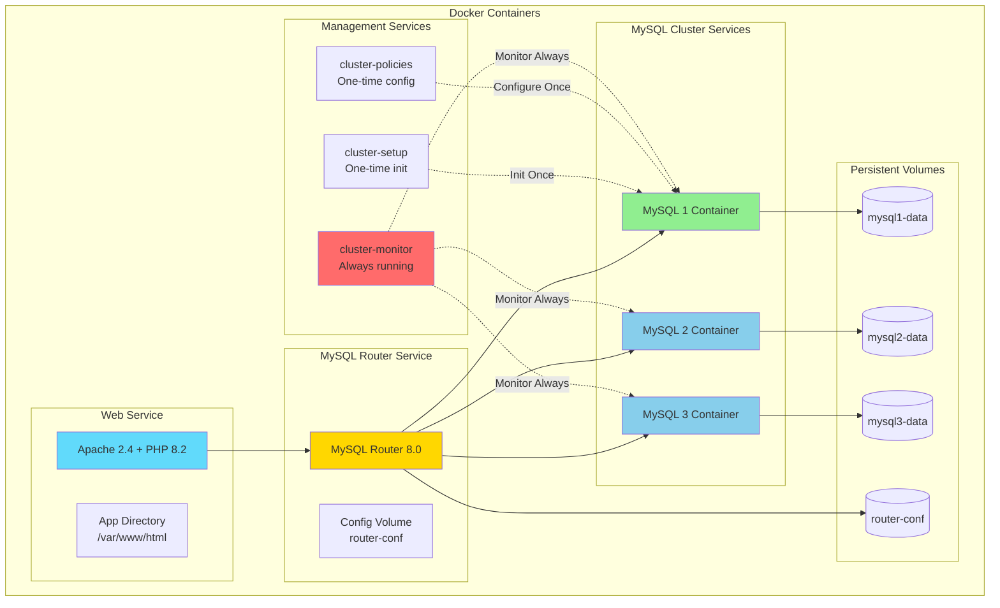

### Dependencias de Servicios

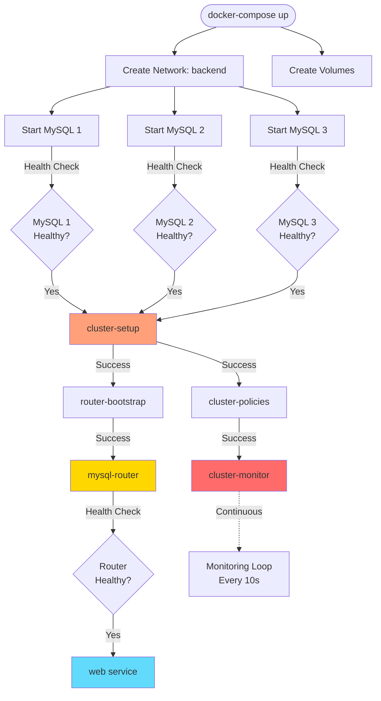

---

## Topología del Cluster MySQL

### Group Replication - Single Primary Mode

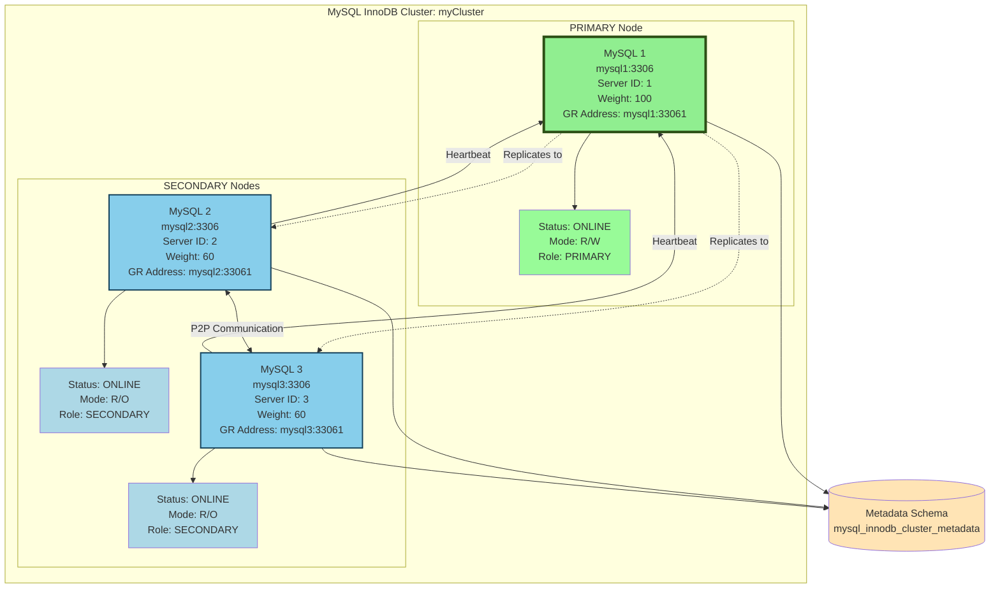

### Configuración de Group Replication

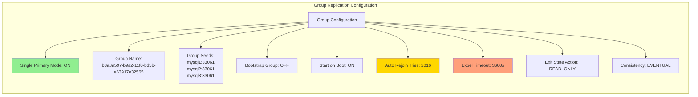

---

## Flujo de Datos

### Flujo de Escritura (INSERT/UPDATE/DELETE)

```mermaid
sequenceDiagram
    participant User as 👤 Usuario
    participant Web as Web App
    participant Router as MySQL Router<br/>:6446 (RW)
    participant M1 as MySQL 1<br/>PRIMARY
    participant M2 as MySQL 2<br/>SECONDARY
    participant M3 as MySQL 3<br/>SECONDARY
    
    User->>Web: HTTP Request<br/>(Crear Asistencia)
    Web->>Router: INSERT INTO asistencias<br/>via PDO
    Router->>M1: Route to PRIMARY
    M1->>M1: Execute INSERT<br/>Generate GTID
    M1-->>M2: Replicate via GR
    M1-->>M3: Replicate via GR
    M2->>M2: Apply Transaction
    M3->>M3: Apply Transaction
    M2-->>M1: ACK
    M3-->>M1: ACK
    M1-->>Router: Success
    Router-->>Web: Query OK
    Web-->>User: 200 OK<br/>(Registro creado)
    
    Note over M1,M3: Group Replication ensures<br/>all nodes have same data
```

### Flujo de Lectura (SELECT)

```mermaid
sequenceDiagram
    participant User as 👤 Usuario
    participant Web as Web App
    participant RouterRO as MySQL Router<br/>:6447 (RO)
    participant M2 as MySQL 2<br/>SECONDARY
    participant M3 as MySQL 3<br/>SECONDARY
    
    User->>Web: HTTP Request<br/>(Ver Dashboard)
    Web->>RouterRO: SELECT * FROM empleados
    
    alt Load Balance to MySQL 2
        RouterRO->>M2: Execute SELECT
        M2-->>RouterRO: Result Set
    else Load Balance to MySQL 3
        RouterRO->>M3: Execute SELECT
        M3-->>RouterRO: Result Set
    end
    
    RouterRO-->>Web: Data
    Web-->>User: 200 OK<br/>(HTML rendered)
    
    Note over M2,M3: Read load is distributed<br/>between SECONDARY nodes
```

---

## Proceso de Failover

### Failover Automático cuando PRIMARY cae

```mermaid
sequenceDiagram
    participant Router as MySQL Router
    participant M1 as MySQL 1<br/>PRIMARY ❌
    participant M2 as MySQL 2<br/>SECONDARY
    participant M3 as MySQL 3<br/>SECONDARY
    participant Monitor as Cluster Monitor
    
    Note over M1: MySQL 1 crashes
    M1->>M1: ❌ OFFLINE
    
    M2->>M2: Detect M1 unreachable
    M3->>M3: Detect M1 unreachable
    
    M2->>M3: No quorum!<br/>Need new PRIMARY
    M3->>M2: Agree, let's elect
    
    Note over M2,M3: Election based on<br/>memberWeight + GTID
    
    M2->>M2: ✅ I become PRIMARY<br/>(Weight: 60)
    M2-->>M3: I am new PRIMARY
    M3->>M3: Stay as SECONDARY
    
    Router->>M2: Detect new PRIMARY
    Router->>Router: Update routing:<br/>RW → mysql2:3306
    
    Monitor->>M1: Try to reconnect
    Monitor->>M2: Check cluster status
    M2-->>Monitor: Status: OK_NO_TOLERANCE<br/>PRIMARY: mysql2:3306
    Monitor->>Monitor: Update router state.json<br/>with available nodes
    
    alt M1 comes back online
        M1->>M1: ✅ Restart
        Monitor->>M1: Detect M1 available
        Monitor->>M2: Get cluster handle
        Monitor->>M2: cluster.rejoinInstance(mysql1)
        M2->>M1: Sync data via GR
        M1->>M1: Join as SECONDARY
        
        Note over M1,M3: All 3 nodes ONLINE again
        
        Monitor->>Monitor: Prefer mysql1 as PRIMARY?
        Monitor->>M2: cluster.setPrimaryInstance(mysql1)
        M2->>M1: Transfer PRIMARY role
        M1->>M1: ✅ Become PRIMARY again
        M2->>M2: Become SECONDARY
        
        Router->>Router: Update routing:<br/>RW → mysql1:3306
    end
```

### Escenario: Solo 1 Nodo Disponible

```mermaid
flowchart TD
    START([Todos los nodos caen])
    
    START --> ALLDOWN[mysql1: ❌ OFFLINE<br/>mysql2: ❌ OFFLINE<br/>mysql3: ❌ OFFLINE]
    
    ALLDOWN --> WAIT[Monitor detecta:<br/>0 nodos disponibles]
    
    WAIT --> M3START[mysql3 se inicia]
    
    M3START --> DETECT[Monitor detecta:<br/>1 nodo disponible]
    
    DETECT --> TRY1{Try getCluster}
    
    TRY1 -->|Error| TRY2{Try rebootClusterFromCompleteOutage}
    TRY1 -->|Success + NO_QUORUM| FORCE1[forceQuorumUsingPartitionOf<br/>mysql3:3306]
    
    TRY2 -->|Success| BOOT[✅ Cluster rebooted<br/>with mysql3]
    TRY2 -->|Error| TRY3{Try getCluster again}
    
    TRY3 -->|Success + NO_QUORUM| FORCE2[forceQuorumUsingPartitionOf<br/>mysql3:3306]
    TRY3 -->|Success + OK| OK1[✅ Cluster OK]
    
    FORCE1 --> OK2[✅ Cluster OK<br/>with 1 node]
    FORCE2 --> OK3[✅ Cluster OK<br/>with 1 node]
    BOOT --> OK4[✅ Cluster OK<br/>with 1 node]
    
    OK1 --> OPERATE[Cluster operando<br/>con 1 solo nodo]
    OK2 --> OPERATE
    OK3 --> OPERATE
    OK4 --> OPERATE
    
    OPERATE --> UPDATE[Monitor actualiza<br/>router state.json<br/>solo con mysql3]
    
    UPDATE --> READY[✅ Sistema funcional<br/>con 1 nodo]
    
    style START fill:#FF6B6B
    style ALLDOWN fill:#FFB6C1
    style READY fill:#90EE90
    style OPERATE fill:#98FB98
```

---

## Auto-Recovery

### Ciclo de Monitoreo Continuo

```mermaid
flowchart TD
    INIT([Monitor Inicia])
    
    INIT --> DELAY[Espera inicial:<br/>25 segundos]
    
    DELAY --> LOOP[Iniciar Loop]
    
    LOOP --> ITER[Iteración N]
    
    ITER --> TRY{getCluster<br/>accesible?}
    
    TRY -->|No| RECOVER[Ejecutar<br/>rebootClusterIfNeeded]
    TRY -->|Sí| STATUS[Obtener<br/>cluster.status]
    
    RECOVER --> CHECK1{Hay nodos<br/>disponibles?}
    CHECK1 -->|No| SLEEP1[Esperar 10s]
    CHECK1 -->|1 nodo| SINGLE[Proceso para<br/>1 solo nodo]
    CHECK1 -->|2+ nodos| REBOOT[rebootClusterFromCompleteOutage<br/>force: true]
    
    SINGLE --> FORCE[forceQuorum o<br/>reboot]
    
    FORCE --> SLEEP1
    REBOOT --> SLEEP1
    
    STATUS --> COUNT[Contar nodos<br/>ONLINE]
    
    COUNT --> DEGRADED{Nodos < 3?}
    
    DEGRADED -->|Sí| UPDATEROUTER[Actualizar<br/>router state.json]
    DEGRADED -->|No| POLICY{Tiempo para<br/>enforcar políticas?}
    
    UPDATEROUTER --> POLICY
    
    POLICY -->|Sí| ENFORCE[ensureClusterOptions<br/>enforcePreferredPrimary]
    POLICY -->|No| CLSTATUS{Cluster<br/>Status?}
    
    ENFORCE --> CLSTATUS
    
    CLSTATUS -->|OK/OK_PARTIAL| HEAL[autoRejoinNodes<br/>checkMissingInstances]
    CLSTATUS -->|NO_QUORUM| FORCEQUORUM[forceQuorumUsingPartitionOf]
    CLSTATUS -->|Otro| RESCAN[cluster.rescan]
    
    HEAL --> RESCAN
    FORCEQUORUM --> RESCAN
    
    RESCAN --> PREFPRIMARY[Enforcar PRIMARY<br/>preferido si es posible]
    
    PREFPRIMARY --> SLEEP2[Esperar 10s]
    
    SLEEP1 --> LOOP
    SLEEP2 --> LOOP
    
    style INIT fill:#61DAFB
    style RECOVER fill:#FFA07A
    style SINGLE fill:#FFD700
    style UPDATEROUTER fill:#FFB6C1
    style HEAL fill:#90EE90
```

### Funciones de Auto-Recovery

```mermaid
graph TB
    subgraph "cluster-monitor.py"
        MAIN[checkAndHealCluster<br/>Función Principal]
        
        MAIN --> F1[rebootClusterIfNeeded]
        MAIN --> F2[ensureClusterOptions]
        MAIN --> F3[enforcePreferredPrimary]
        MAIN --> F4[autoRejoinNodes]
        MAIN --> F5[checkMissingInstances]
        MAIN --> F6[updateRouterStateJson]
        
        F1 --> F1A[findAvailableInstances]
        F1 --> F1B[forceQuorumOnSingleNode]
        
        F4 --> F4A[Reintentar nodos<br/>OFFLINE/ERROR]
        F5 --> F5A[Añadir nodos<br/>MISSING]
        F6 --> F6A[Actualizar<br/>state.json del Router]
    end
    
    style MAIN fill:#FF6B6B,stroke:#8B0000,stroke-width:3px
    style F1 fill:#FFA07A
    style F6 fill:#FFD700
```

---

## Estados del Cluster

### Posibles Estados

```mermaid
stateDiagram-v2
    [*] --> OFFLINE: Cluster no iniciado
    
    OFFLINE --> REBOOTING: rebootClusterFromCompleteOutage()
    
    REBOOTING --> OK: 3 nodos ONLINE
    REBOOTING --> OK_NO_TOLERANCE: 2 nodos ONLINE
    REBOOTING --> OK_NO_TOLERANCE: 1 nodo ONLINE + forceQuorum
    REBOOTING --> NO_QUORUM: Falló el reboot
    
    OK --> OK_PARTIAL: 1 nodo cae
    OK_PARTIAL --> OK_NO_TOLERANCE: Otro nodo cae
    OK_NO_TOLERANCE --> NO_QUORUM: Quórum perdido
    
    OK_NO_TOLERANCE --> OK_PARTIAL: Nodo se recupera
    OK_PARTIAL --> OK: Todos los nodos OK
    
    NO_QUORUM --> OK_NO_TOLERANCE: forceQuorumUsingPartitionOf()
    NO_QUORUM --> OK: rebootClusterFromCompleteOutage()
    
    OK --> [*]: Shutdown ordenado
    
    note right of OK
        3 nodos ONLINE
        Redundancia total
        R/W y R/O funcionan
    end note
    
    note right of OK_PARTIAL
        2 nodos ONLINE
        Puede tolerar 1 fallo más
        R/W y R/O funcionan
    end note
    
    note right of OK_NO_TOLERANCE
        1-2 nodos ONLINE
        No puede tolerar más fallos
        R/W funciona, R/O limitado
    end note
    
    note right of NO_QUORUM
        Quórum perdido
        Cluster no funcional
        Necesita intervención
    end note
```

### Matriz de Estados y Acciones

| Estado Cluster | Nodos ONLINE | Acción del Monitor | Router State |
|---------------|--------------|-------------------|--------------|
| **OK** | 3/3 | Monitoreo normal | Todos los nodos |
| **OK_PARTIAL** | 2/3 | Monitor + Update router state | 2 nodos |
| **OK_NO_TOLERANCE** | 1-2/3 | Update router + Force quorum si es 1 | Nodos disponibles |
| **NO_QUORUM** | 0-1/3 | Force quorum o reboot | Nodo único si hay 1 |
| **OFFLINE** | 0/3 | Esperar nodos + Reboot cuando haya 1+ | N/A |

---

## Resumen de Puertos

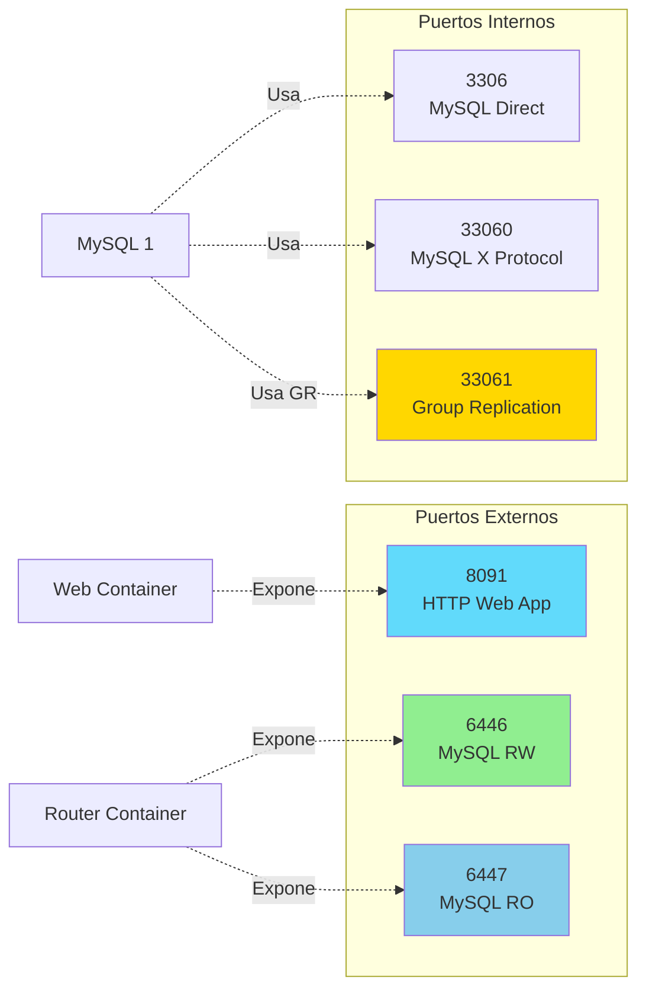

---

## Siguiente: Configuración

Ver **[CONFIGURACION.md](CONFIGURACION.md)** para detalles de todos los parámetros configurables.

[← Volver al README](README.md) | [Siguiente: Configuración →](CONFIGURACION.md)
