# 💻 Explicación del Código

## Índice

1. [Scripts de Inicialización](#scripts-de-inicialización)
2. [Cluster Monitor](#cluster-monitor)
3. [Aplicación Web](#aplicación-web)
4. [Funciones Clave](#funciones-clave)
5. [Flujos de Ejecución](#flujos-de-ejecución)

---

## Scripts de Inicialización

### mysql/init-cluster.js

Script que **inicializa el cluster** por primera vez. Se ejecuta una sola vez.

#### Estructura del Script


#### Código Explicado

**1. Configurar Instancias**

```javascript
function configureInstance(uri) {
  print('Configuring instance: ' + uri);
  try {
    dba.configureInstance(uri, {
      clusterAdmin: 'root',
      clusterAdminPassword: '1234',
      restart: false
    });
  } catch (e) {
    print('Note: ' + e);
  }
}
```

- **Propósito**: Prepara cada nodo MySQL para Group Replication
- **Parámetros**:
  - `uri`: Dirección del nodo (ej: `root:1234@mysql1:3306`)
  - `clusterAdmin`: Usuario administrador del cluster
  - `restart`: false (no reiniciar automáticamente)

**2. Crear o Recuperar Cluster**

```javascript
if (!cluster) {
  try {
    cluster = dba.getCluster('myCluster');
    print('Cluster myCluster found');
  } catch (e) {
    // Cluster no existe, intentar reboot
    try {
      cluster = dba.rebootClusterFromCompleteOutage('myCluster', {force: true});
    } catch (rebootErr) {
      // Crear cluster nuevo
      cluster = dba.createCluster('myCluster', {
        autoRejoinTries: 2016,
        expelTimeout: 3600,
        consistency: 'EVENTUAL',
        exitStateAction: 'READ_ONLY',
        memberWeight: 50,
        multiPrimary: false,
        force: true,
        clearReadOnly: true,
        groupName: 'b8a8a597-b9a2-11f0-bd5b-e63917e32565'
      });
    }
  }
}
```

**Opciones Explicadas**:
- `autoRejoinTries: 2016`: Máximo de reintentos
- `expelTimeout: 3600`: 1 hora antes de expulsar
- `consistency: 'EVENTUAL'`: Consistencia eventual (más rápido)
- `exitStateAction: 'READ_ONLY'`: Al salir → modo lectura
- `multiPrimary: false`: Modo single-primary
- `groupName`: ID fijo del grupo para el Router

**3. Añadir Instancias**

```javascript
function addIfMissing(uri) {
  const status = cluster.status();
  const topology = status.defaultReplicaSet.topology;
  const host = uri.split('@')[1];
  
  // Verificar si ya está en el cluster
  for (const [key, value] of Object.entries(topology)) {
    if (key.includes(host) || value.address === host) {
      // Ya existe, verificar si necesita rejoin
      if (value.status === 'OFFLINE' || value.status === '(MISSING)') {
        cluster.rejoinInstance(uri, {memberSslMode: 'REQUIRED'});
      }
      return;
    }
  }
  
  // No está, añadirlo
  cluster.addInstance(uri, { 
    recoveryMethod: 'clone',
    autoRejoinTries: 2016,
    exitStateAction: 'READ_ONLY',
    memberSslMode: 'REQUIRED',
    waitRecovery: 2
  });
}
```

**Lógica**:
1. Verifica si la instancia ya está en el cluster
2. Si está pero OFFLINE → intenta rejoin
3. Si no está → la añade con clone recovery

### mysql/configure-policies.js

Script que **configura políticas** avanzadas del cluster.

```javascript
const desiredInstanceWeights = {
  'mysql1:3306': 100,  // Preferido como PRIMARY
  'mysql2:3306': 60,
  'mysql3:3306': 60
};

// Configurar opciones del cluster
cluster.setOption('autoRejoinTries', 2016);
cluster.setOption('expelTimeout', 3600);
cluster.setOption('exitStateAction', 'READ_ONLY');
cluster.setOption('consistency', 'EVENTUAL');

// Asignar pesos
for (const [instance, weight] of Object.entries(desiredInstanceWeights)) {
  cluster.setInstanceOption(instance, 'memberWeight', weight);
}

// Enforcar PRIMARY preferido
cluster.setPrimaryInstance('mysql1:3306');
```

---

## Cluster Monitor

### mysql/cluster-monitor.py

El **corazón del sistema de auto-recovery**. Ejecuta un loop infinito cada 10 segundos.

> **Nota**: Implementado en Python para tener acceso completo al sistema de archivos y poder actualizar `state.json` del Router de manera dinámica.

#### Diagrama de Funciones


#### Funciones Principales

**1. checkAndHealCluster()**

```javascript
function checkAndHealCluster() {
  const cluster = getClusterSafely();

  if (!cluster) {
    // Cluster no accesible, intentar recovery
    rebootClusterIfNeeded();
    return;
  }

  const status = cluster.status();
  const clusterStatus = status.defaultReplicaSet.status;
  const topology = status.defaultReplicaSet.topology;
  
  // Contar nodos ONLINE
  const onlineNodes = Object.keys(topology).filter(key => 
    topology[key].status === 'ONLINE'
  );
  
  // Si solo 1 nodo ONLINE con NO_QUORUM
  if (onlineNodes.length === 1 && clusterStatus === 'NO_QUORUM') {
    const nodeAddr = topology[onlineNodes[0]].address;
    cluster.forceQuorumUsingPartitionOf(nodeAddr);
  }
  
  // Si cluster degradado (< 3 nodos), actualizar Router
  if (onlineNodes.length > 0 && onlineNodes.length < 3) {
    const addresses = onlineNodes.map(key => topology[key].address);
    updateRouterStateJson(addresses);
  }
  
  // Auto-rejoin de nodos
  autoRejoinNodes(cluster, status);
  
  // Enforcar PRIMARY preferido
  enforcePreferredPrimary(cluster, status);
}
```

**2. rebootClusterIfNeeded()**

```javascript
function rebootClusterIfNeeded() {
  // Encontrar nodos disponibles
  const availableInstances = findAvailableInstances();
  
  if (availableInstances.length === 0) {
    return false;
  }
  
  const primaryUri = availableInstances[0];
  shell.connect(primaryUri);
  
  // Caso especial: Solo 1 nodo
  if (availableInstances.length === 1) {
    try {
      const cluster = dba.getCluster('myCluster');
      const status = cluster.status();
      const clusterStatus = status.defaultReplicaSet.status;
      
      if (clusterStatus === 'OK' || clusterStatus === 'OK_NO_TOLERANCE') {
        return true; // Ya está OK
      }
      
      // Si NO_QUORUM, forzar quorum
      if (clusterStatus === 'NO_QUORUM') {
        const onlineNode = /* encontrar nodo ONLINE */;
        cluster.forceQuorumUsingPartitionOf(onlineNode);
        return true;
      }
    } catch (e) {
      // Intentar reboot
      dba.rebootClusterFromCompleteOutage('myCluster', {force: true});
    }
  }
  
  // Caso normal: 2+ nodos
  dba.rebootClusterFromCompleteOutage('myCluster', {force: true});
}
```

**3. autoRejoinNodes()**

```javascript
function autoRejoinNodes(cluster, status) {
  const topology = status.defaultReplicaSet.topology;
  
  for (let uri of instances) {
    const host = uri.split('@')[1];
    
    // Buscar este nodo en la topología
    for (let nodeKey in topology) {
      const node = topology[nodeKey];
      const nodeAddr = node.address || nodeKey;
      
      if (nodeAddr === host) {
        // Si está OFFLINE o ERROR, intentar rejoin
        if (node.status === 'OFFLINE' || node.status === 'ERROR') {
          try {
            cluster.rejoinInstance(uri, {memberSslMode: 'REQUIRED'});
            print(`✅ ${host} rejoined successfully`);
          } catch (e) {
            print(`⚠️ Could not rejoin ${host}: ${e}`);
          }
        }
      }
    }
  }
}
```

**4. updateRouterStateJson()**

```javascript
function updateRouterStateJson(availableNodes) {
  const grId = 'b8a8a597-b9a2-11f0-bd5b-e63917e32565';
  const serverList = availableNodes.map(node => 
    `            "mysql://${node}"`
  ).join(',\n');
  
  const stateJson = `{
    "metadata-cache": {
        "group-replication-id": "${grId}",
        "cluster-metadata-servers": [
${serverList}
        ]
    },
    "version": "1.0.0"
}`;
  
  // Escribir a /router-state/data/state.json
  const file = os.openFile('/router-state/data/state.json', 'w');
  file.write(stateJson);
  file.close();
  
  print('✅ Router state.json actualizado');
}
```

**Propósito**: Actualiza la lista de nodos disponibles para el Router cuando el cluster está degradado.

---

## Aplicación Web

### web/src/index.php

Aplicación PHP que gestiona sobretiempos.

#### Diagrama de Flujo

```mermaid
flowchart TD
    START([Usuario accede])
    
    START --> CONNECT[db_connect<br/>Conectar a Router]
    
    CONNECT --> RETRY{¿Conexión<br/>exitosa?}
    
    RETRY -->|No| WAIT[Esperar 3s<br/>Backoff exponencial]
    WAIT --> RETRY2{¿Reintentos<br/>< 10?}
    RETRY2 -->|Sí| CONNECT
    RETRY2 -->|No| ERROR[Mostrar Error]
    
    RETRY -->|Sí| QUERY[Ejecutar Queries]
    
    QUERY --> INFO[Obtener Server Info]
    INFO --> SECTION{¿Qué<br/>Sección?}
    
    SECTION -->|Dashboard| DASH[Mostrar Dashboard]
    SECTION -->|Empleados| EMP[Gestionar Empleados]
    SECTION -->|Asistencias| ASIS[Gestionar Asistencias]
    SECTION -->|Reportes| REP[Mostrar Reportes]
    
    DASH --> RENDER[Renderizar HTML]
    EMP --> RENDER
    ASIS --> RENDER
    REP --> RENDER
    
    RENDER --> END([Respuesta HTTP])
    
    style CONNECT fill:#61DAFB
    style RETRY fill:#FFD700
    style QUERY fill:#90EE90
```



#### Función de Conexión

```php
function db_connect($cfg, $retries = 10, $sleep = 3) {
  $dsn = sprintf('mysql:host=%s;port=%d;dbname=%s;charset=utf8mb4', 
    $cfg['host'], $cfg['port'], $cfg['db']);
  
  $lastError = null;
  
  for ($i = 0; $i < $retries; $i++) {
    try {
      $pdo = new PDO($dsn, $cfg['user'], $cfg['pass'], [
        PDO::ATTR_ERRMODE => PDO::ERRMODE_EXCEPTION,
        PDO::ATTR_DEFAULT_FETCH_MODE => PDO::FETCH_ASSOC,
        PDO::ATTR_PERSISTENT => false,
        PDO::ATTR_TIMEOUT => 10,
        PDO::MYSQL_ATTR_CONNECT_TIMEOUT => 10,
        PDO::MYSQL_ATTR_READ_TIMEOUT => 10,
        PDO::MYSQL_ATTR_WRITE_TIMEOUT => 10,
      ]);
      
      // Test de conexión
      $pdo->query('SELECT 1');
      return $pdo;
      
    } catch (PDOException $e) {
      $lastError = $e;
      $errorCode = $e->getCode();
      
      // Códigos de error que justifican reintentar
      $retryableCodes = ['HY000', '2002', '2003', '2006', '2013'];
      
      if (in_array($errorCode, $retryableCodes) && $i < $retries - 1) {
        // Backoff exponencial (limitado a 15s)
        $waitTime = min($sleep * ($i + 1), 15);
        sleep($waitTime);
        continue;
      }
      
      if ($i === $retries - 1) {
        throw new PDOException("No se pudo conectar después de $retries intentos");
      }
    }
  }
}
```

**Características**:
- **Reintentos automáticos**: 10 intentos por defecto
- **Backoff exponencial**: 3s, 6s, 9s, 12s, 15s, 15s...
- **Códigos retryables**: Errores de conexión temporales
- **Timeouts configurados**: 10s para cada operación

---

## Funciones Clave

### Comparación de Funciones Críticas

| Función | Archivo | Cuándo se Ejecuta | Propósito |
|---------|---------|-------------------|-----------|
| `configureInstance` | init-cluster.js | Una vez al inicio | Preparar nodo para GR |
| `createCluster` | init-cluster.js | Una vez al inicio | Crear cluster nuevo |
| `rebootClusterFromCompleteOutage` | init-cluster.js, cluster-monitor.js | Cuando cluster caído | Reiniciar cluster |
| `checkAndHealCluster` | cluster-monitor.js | Cada 10 segundos | Verificar y sanar |
| `forceQuorumUsingPartitionOf` | cluster-monitor.js | Cuando NO_QUORUM | Forzar quorum |
| `autoRejoinNodes` | cluster-monitor.js | Cada ciclo si OK | Rejoin nodos OFFLINE |
| `updateRouterStateJson` | cluster-monitor.js | Si cluster degradado | Actualizar Router |
| `db_connect` | index.php | Cada request web | Conectar a BD |

### Flujo de Datos: Escritura


---

## Flujos de Ejecución

### Inicialización Completa


### Recovery desde Outage Completo

```mermaid
sequenceDiagram
    participant MON as cluster-monitor
    participant M1 as MySQL 1
    participant M2 as MySQL 2
    participant M3 as MySQL 3
    
    Note over M1,M3: Todos los nodos caídos
    
    MON->>M1: tryConnect → FAIL
    MON->>M2: tryConnect → FAIL
    MON->>M3: tryConnect → FAIL
    MON->>MON: 0 nodos disponibles
    MON->>MON: Esperar 10s
    
    Note over M3: MySQL 3 se inicia
    
    MON->>M1: tryConnect → FAIL
    MON->>M2: tryConnect → FAIL
    MON->>M3: tryConnect → SUCCESS
    MON->>M3: shell.connect(mysql3)
    MON->>M3: getCluster → ERROR
    MON->>M3: rebootClusterFromCompleteOutage(force:true)
    M3->>M3: Bootstrap as PRIMARY
    M3->>MON: Cluster rebooted
    MON->>M3: forceQuorumUsingPartitionOf(mysql3)
    M3->>MON: Quorum OK
    MON->>MON: updateRouterStateJson([mysql3])
    
    Note over M3: Cluster operando con 1 nodo
```



---

[← Configuración](CONFIGURACION.md) | [Volver al README](README.md) | [Siguiente: Operación →](OPERACION.md)
