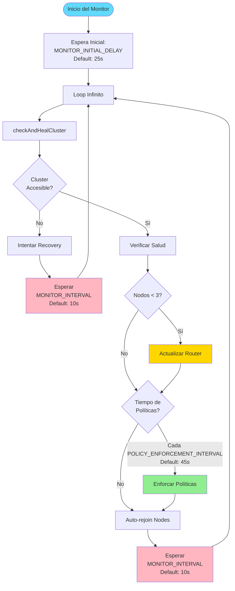

# ⚙️ Configuración del Sistema

## Índice

1. [Variables de Entorno](#variables-de-entorno)
2. [Parámetros de MySQL](#parámetros-de-mysql)
3. [Configuración del Monitor](#configuración-del-monitor)
4. [Ajustar Tiempos de Verificación](#ajustar-tiempos-de-verificación)
5. [Optimización de Rendimiento](#optimización-de-rendimiento)
6. [Configuración Avanzada](#configuración-avanzada)

---

## Variables de Entorno

### docker-compose.yml - Cluster Monitor

```yaml
cluster-monitor:
  environment:
    MYSQL_ROOT_PASSWORD: "1234"           # Password de root MySQL
    MONITOR_INTERVAL: "10"                 # Intervalo de verificación (segundos)
    PREFERRED_PRIMARY: "mysql1:3306"       # Nodo preferido como PRIMARY
    MONITOR_INITIAL_DELAY: "25"           # Espera inicial antes de empezar (segundos)
    POLICY_ENFORCEMENT_INTERVAL: "45"     # Cada cuánto enforza políticas (segundos)
```

#### Detalles de Cada Variable

| Variable | Valor Default | Descripción | Rango Recomendado |
|----------|---------------|-------------|-------------------|
| `MONITOR_INTERVAL` | `10` | Cada cuántos segundos verifica el cluster | 5-30 segundos |
| `PREFERRED_PRIMARY` | `mysql1:3306` | Nodo que se prefiere como PRIMARY | mysql1/2/3:3306 |
| `MONITOR_INITIAL_DELAY` | `25` | Tiempo de espera antes de iniciar monitoreo | 20-60 segundos |
| `POLICY_ENFORCEMENT_INTERVAL` | `45` | Frecuencia de aplicar políticas del cluster | 30-300 segundos |

### docker-compose.yml - Cluster Setup

```yaml
cluster-setup:
  environment:
    MYSQL_ROOT_PASSWORD: "1234"    # Password de root
    APP_DB: "appdb"                # Nombre de la base de datos
    APP_USER: "app"                # Usuario de la aplicación
    APP_PASSWORD: "1234"           # Password del usuario
    PREFERRED_PRIMARY: "mysql1:3306"  # PRIMARY preferido
```

### docker-compose.yml - Web Application

```yaml
web:
  environment:
    DB_HOST: mysql-router          # Hostname del Router
    DB_PORT: "6446"                # Puerto RW del Router
    DB_USER: "app"                 # Usuario de base de datos
    DB_PASSWORD: "1234"            # Password
    DB_NAME: "appdb"               # Nombre de la base de datos
```

---

## Parámetros de MySQL

### Group Replication - Configuración por Nodo

```yaml
# Ejemplo para mysql1
mysql1:
  command: [
    "--server-id=1",                                          # ID único del servidor
    "--report-host=mysql1",                                   # Nombre de host reportado
    
    # Group Replication
    "--loose-group_replication_start_on_boot=ON",            # Auto-iniciar GR al arrancar
    "--loose-group_replication_bootstrap_group=OFF",          # No hacer bootstrap automático
    "--loose-group_replication_single_primary_mode=ON",       # Modo single-primary
    "--loose-group_replication_enforce_update_everywhere_checks=OFF",  # No multi-primary
    
    # Direcciones de comunicación
    "--loose-group_replication_local_address=mysql1:33061",   # Dirección local para GR
    "--loose-group_replication_group_seeds=mysql1:33061,mysql2:33061,mysql3:33061",  # Todos los nodos
    
    # Políticas de recovery
    "--loose-group_replication_exit_state_action=READ_ONLY", # Al salir del grupo → READ_ONLY
    "--loose-group_replication_member_expel_timeout=3600",    # Tiempo antes de expulsar (segundos)
    "--loose-group_replication_autorejoin_tries=2016",        # Intentos de auto-rejoin
    
    # Otros
    "--max-connections=500"                                   # Conexiones máximas
  ]
```

### Parámetros Explicados

#### server-id
- **Valor**: Único por nodo (1, 2, 3)
- **Propósito**: Identificar cada servidor en replicación
- **No cambiar** después de inicializar

#### group_replication_local_address
- **Formato**: `hostname:puerto`
- **Puerto**: 33061 (estándar para GR)
- **Debe ser único** para cada nodo

#### group_replication_group_seeds
- **Formato**: Lista separada por comas de todas las direcciones del grupo
- **Importante**: Incluir TODOS los nodos para descubrimiento automático
- **Ejemplo**: `mysql1:33061,mysql2:33061,mysql3:33061`

#### group_replication_autorejoin_tries
- **Valor**: 0-2016
- **Default**: 2016 (máximo)
- **Significado**: Número de intentos de auto-rejoin antes de rendirse
- **Recomendación**: 
  - Producción: 2016 (intentos ilimitados efectivamente)
  - Testing: 10-50 (más rápido para probar)

#### group_replication_member_expel_timeout
- **Valor**: 0-3600 segundos
- **Default**: 3600 (1 hora)
- **Significado**: Tiempo que un nodo puede estar inaccesible antes de ser expulsado
- **Recomendación**:
  - Alta disponibilidad: 3600 (tolerante)
  - Testing rápido: 300 (5 minutos)

#### group_replication_exit_state_action
- **Opciones**: `READ_ONLY`, `OFFLINE_MODE`, `ABORT_SERVER`
- **Default**: `READ_ONLY`
- **Significado**: Qué hacer cuando el nodo sale del grupo
- **Recomendación**: `READ_ONLY` (evita escrituras inconsistentes)

---

## Configuración del Monitor

El archivo `mysql/cluster-monitor.py` tiene varias constantes configurables:

```javascript
// Constantes de configuración
const monitorInterval = parseInt(os.getenv('MONITOR_INTERVAL') || '10') * 1000;  // 10 segundos
const preferredPrimary = os.getenv('PREFERRED_PRIMARY') || 'mysql1:3306';
const initialDelay = parseInt(os.getenv('MONITOR_INITIAL_DELAY') || '25') * 1000;  // 25 segundos
const policyEnforcementInterval = parseInt(os.getenv('POLICY_ENFORCEMENT_INTERVAL') || '45');  // 45 segundos
```

### Diagrama de Flujo del Monitor



---

## Ajustar Tiempos de Verificación

### Para Verificación MÁS RÁPIDA

#### 1. Reducir intervalo de monitoreo (más agresivo)

**Archivo**: `docker-compose.yml`

```yaml
cluster-monitor:
  environment:
    MONITOR_INTERVAL: "5"                  # Cambiar de 10 a 5 segundos
    POLICY_ENFORCEMENT_INTERVAL: "20"     # Cambiar de 45 a 20 segundos
```

**Impacto**:
- ✅ Detección de fallos más rápida (5s vs 10s)
- ✅ Recovery más ágil
- ⚠️ Más carga en los nodos MySQL (más conexiones)
- ⚠️ Más logs generados

#### 2. Reducir timeouts de Group Replication

**Archivo**: `docker-compose.yml` (cada nodo mysql)

```yaml
mysql1:
  command: [
    # ... otros parámetros ...
    "--loose-group_replication_member_expel_timeout=300",     # 5 minutos en lugar de 1 hora
    "--loose-group_replication_autorejoin_tries=100",         # 100 intentos en lugar de 2016
  ]
```

**Impacto**:
- ✅ Nodos expulsados más rápido si no responden
- ⚠️ Menos tolerante a fallos de red temporales

#### 3. Healthchecks más frecuentes

**Archivo**: `docker-compose.yml`

```yaml
mysql1:
  healthcheck:
    interval: 3s          # Cambiar de 5s a 3s
    timeout: 3s           # Reducir de 5s a 3s
    retries: 10           # Reducir de 30 a 10
    start_period: 20s     # Reducir de 30s a 20s
```

### Para Verificación MÁS LENTA (Ahorro de recursos)

```yaml
cluster-monitor:
  environment:
    MONITOR_INTERVAL: "30"                 # Cada 30 segundos
    POLICY_ENFORCEMENT_INTERVAL: "120"    # Cada 2 minutos
    
mysql1:
  healthcheck:
    interval: 10s
    timeout: 10s
    retries: 50
    start_period: 60s
    
  command: [
    "--loose-group_replication_member_expel_timeout=7200",    # 2 horas
    "--loose-group_replication_autorejoin_tries=2016",        # Máximo
  ]
```

### Configuración Recomendada por Escenario

| Escenario | MONITOR_INTERVAL | POLICY_ENFORCEMENT | expel_timeout | autorejoin_tries |
|-----------|------------------|-------------------|---------------|------------------|
| **Producción Alta Disponibilidad** | 10s | 45s | 3600s | 2016 |
| **Testing Rápido** | 5s | 20s | 300s | 50 |
| **Desarrollo Local** | 15s | 60s | 1800s | 100 |
| **Ahorro de Recursos** | 30s | 120s | 7200s | 2016 |

---

## Optimización de Rendimiento

### 1. Ajustar Conexiones Máximas

```yaml
mysql1:
  command: [
    "--max-connections=1000"    # Default: 500, aumentar si hay muchas conexiones
  ]
```

### 2. Configurar Buffers de MySQL

```yaml
mysql1:
  command: [
    "--innodb-buffer-pool-size=1G",        # Buffer pool de InnoDB
    "--innodb-log-file-size=256M",         # Tamaño de log files
    "--innodb-flush-log-at-trx-commit=2",  # 0=más rápido, 1=más seguro, 2=balance
  ]
```

### 3. Timeouts de Conexión en PHP

**Archivo**: `web/src/index.php`

```php
function db_connect($cfg, $retries = 10, $sleep = 3) {
  // Ajustar timeouts
  $pdo = new PDO($dsn, $cfg['user'], $cfg['pass'], [
    PDO::ATTR_TIMEOUT => 10,                    // Aumentar si conexiones lentas
    PDO::MYSQL_ATTR_CONNECT_TIMEOUT => 10,      // Timeout de conexión
    PDO::MYSQL_ATTR_READ_TIMEOUT => 10,         // Timeout de lectura
    PDO::MYSQL_ATTR_WRITE_TIMEOUT => 10,        // Timeout de escritura
  ]);
}
```

**Ajustes**:
- Red lenta: Aumentar todos a 20-30 segundos
- Red rápida local: Reducir a 5 segundos
- Queries pesadas: Aumentar READ_TIMEOUT a 60+

---

## Configuración Avanzada

### Pesos de los Nodos (Member Weight)

Archivo `mysql/configure-policies.js`:

```javascript
const desiredInstanceWeights = {
  'mysql1:3306': 100,   // Mayor peso = preferido como PRIMARY
  'mysql2:3306': 60,    // Peso medio
  'mysql3:3306': 60     // Peso medio
};
```

**Para cambiar prioridades**:
- Hacer mysql2 preferido: Cambiar a `'mysql2:3306': 100` y `'mysql1:3306': 60`
- Todos iguales: Poner todos en 50

### Consistency Level

```javascript
cluster.setOption('consistency', 'EVENTUAL');  // Opciones: EVENTUAL, BEFORE_ON_PRIMARY_FAILOVER, BEFORE, AFTER
```

| Nivel | Descripción | Performance | Consistencia |
|-------|-------------|-------------|--------------|
| `EVENTUAL` | Lecturas pueden ser levemente desactualizadas | ⚡⚡⚡ Alto | ⭐⭐ Media |
| `BEFORE_ON_PRIMARY_FAILOVER` | Consistencia solo en failover | ⚡⚡ Medio | ⭐⭐⭐ Alta |
| `BEFORE` | Lecturas esperan sincronización | ⚡ Bajo | ⭐⭐⭐⭐ Muy Alta |
| `AFTER` | Escrituras esperan replicación total | ⚡ Muy Bajo | ⭐⭐⭐⭐⭐ Máxima |

### Router Timeouts

Archivo generado por bootstrap, pero puedes editarlo en:

```ini
# /work/mysqlrouter.conf (dentro del contenedor)
[routing:bootstrap_rw]
connect_timeout = 10        # Segundos
max_connect_errors = 100    # Errores antes de bloquear
```

Para aplicar cambios:
```bash
docker-compose restart mysql-router
```

---

## Tabla Resumen de Configuraciones

### Todas las Variables Configurables

| Componente | Variable/Parámetro | Ubicación | Valor Default | Efecto al Modificar |
|------------|-------------------|-----------|---------------|---------------------|
| Monitor | MONITOR_INTERVAL | docker-compose.yml | 10 | Frecuencia de verificación |
| Monitor | POLICY_ENFORCEMENT_INTERVAL | docker-compose.yml | 45 | Frecuencia de enforcar políticas |
| Monitor | MONITOR_INITIAL_DELAY | docker-compose.yml | 25 | Espera antes de iniciar |
| Monitor | PREFERRED_PRIMARY | docker-compose.yml | mysql1:3306 | Nodo preferido |
| MySQL | autorejoin_tries | docker-compose.yml | 2016 | Reintentos de auto-rejoin |
| MySQL | member_expel_timeout | docker-compose.yml | 3600 | Timeout antes de expulsar |
| MySQL | max_connections | docker-compose.yml | 500 | Conexiones simultáneas |
| MySQL | server-id | docker-compose.yml | 1/2/3 | ID único del servidor |
| Web | DB_PORT | docker-compose.yml | 6446 | Puerto del Router |
| Web | retries | index.php | 10 | Reintentos de conexión |
| Web | sleep | index.php | 3 | Segundos entre reintentos |
| Policies | memberWeight | configure-policies.js | 100/60/60 | Prioridad para PRIMARY |
| Policies | consistency | configure-policies.js | EVENTUAL | Nivel de consistencia |

---

## Ejemplos de Configuración

### Configuración para Testing Rápido

```yaml
# docker-compose.yml
cluster-monitor:
  environment:
    MONITOR_INTERVAL: "5"
    POLICY_ENFORCEMENT_INTERVAL: "15"
    MONITOR_INITIAL_DELAY: "10"

mysql1:
  command: [
    "--loose-group_replication_member_expel_timeout=180",
    "--loose-group_replication_autorejoin_tries=20",
    # ... resto
  ]
  healthcheck:
    interval: 3s
    timeout: 3s
    retries: 5
```

### Configuración para Producción

```yaml
# docker-compose.yml
cluster-monitor:
  environment:
    MONITOR_INTERVAL: "10"
    POLICY_ENFORCEMENT_INTERVAL: "60"
    MONITOR_INITIAL_DELAY: "30"

mysql1:
  command: [
    "--loose-group_replication_member_expel_timeout=7200",
    "--loose-group_replication_autorejoin_tries=2016",
    "--max-connections=1000",
    "--innodb-buffer-pool-size=2G",
    # ... resto
  ]
  healthcheck:
    interval: 10s
    timeout: 10s
    retries: 30
```

---

## Aplicar Cambios

### Después de Modificar docker-compose.yml

```bash
# Recrear servicios afectados
docker-compose up -d --force-recreate cluster-monitor

# O reiniciar todo
docker-compose down
docker-compose up -d
```

### Después de Modificar Scripts JS

```bash
# No necesita recrear, solo reiniciar
docker-compose restart cluster-monitor
docker-compose restart cluster-policies
```

### Verificar Cambios Aplicados

```bash
# Ver variables de entorno del monitor
docker exec docker-cluster-monitor-1 env | grep MONITOR

# Ver configuración de MySQL
docker exec mysql1 mysql -uroot -p1234 -e "SHOW VARIABLES LIKE '%group_replication%';"
```

---

[← Arquitectura](ARQUITECTURA.md) | [Volver al README](README.md) | [Siguiente: Código →](CODIGO.md)
