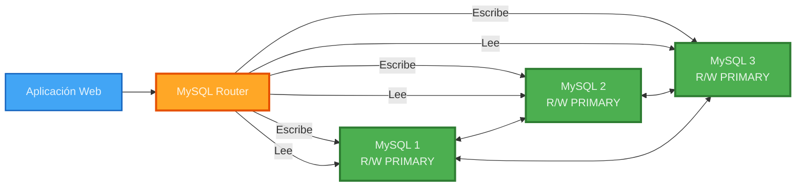
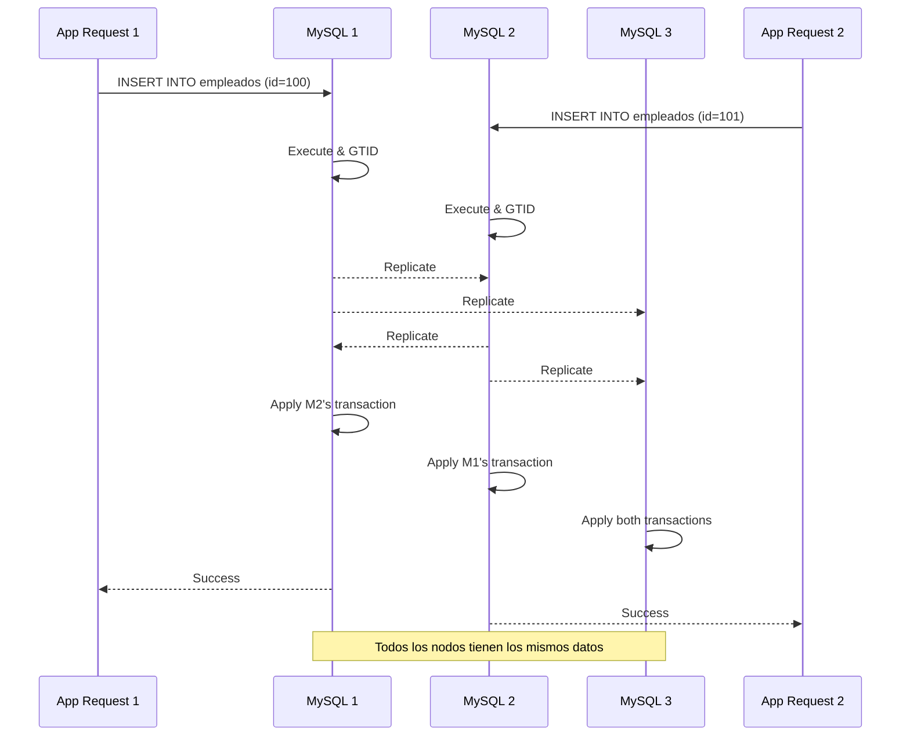
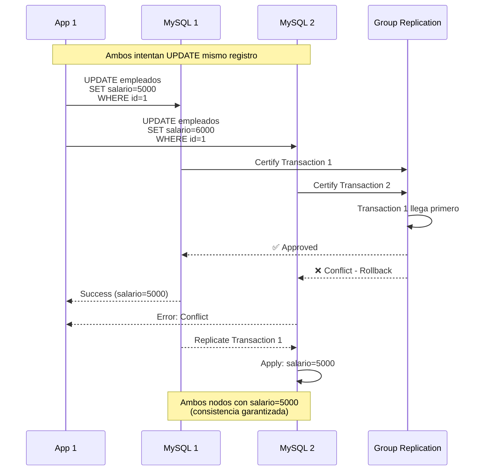

# 🔄 Modo Multi-Primary Activado

## ✅ Cambio Realizado

El cluster MySQL ahora está configurado en **Multi-Primary Mode**, lo que significa:

### ✅ TODOS los nodos pueden LEER y ESCRIBIR



---

## 📋 Archivos Modificados

| Archivo | Cambio | Estado |
|---------|--------|--------|
| `docker-compose.yml` | `single_primary_mode=OFF`<br/>`enforce_update_everywhere_checks=ON` | ✅ Completado |
| `mysql/init-cluster.js` | `multiPrimary: true` | ✅ Completado |
| `web/src/index.php` | Comentario actualizado | ✅ Completado |
| `README.md` | Diagramas y descripciones | ✅ Completado |
| `ARQUITECTURA.md` | Diagramas actualizados | ✅ Completado |

---

## 🆚 Comparación: Single-Primary vs Multi-Primary

### Antes (Single-Primary)

- 🟢 **MySQL 1**: R/W (PRIMARY) - Solo este nodo podía escribir
- 🔵 **MySQL 2**: R/O (SECONDARY) - Solo lectura
- 🔵 **MySQL 3**: R/O (SECONDARY) - Solo lectura

**Ventajas**:
- ✅ Sin conflictos de escritura
- ✅ Más simple

**Desventajas**:
- ❌ Solo 1 nodo para escrituras (cuello de botella)
- ❌ Si PRIMARY cae, espera a elección de nuevo PRIMARY

### Ahora (Multi-Primary)

- 🟢 **MySQL 1**: R/W (PRIMARY) - Puede escribir
- 🟢 **MySQL 2**: R/W (PRIMARY) - Puede escribir
- 🟢 **MySQL 3**: R/W (PRIMARY) - Puede escribir

**Ventajas**:
- ✅ **Todos los nodos aceptan escrituras**
- ✅ Mejor distribución de carga
- ✅ Sin espera de elección de PRIMARY
- ✅ Mayor rendimiento en escrituras distribuidas

**Desventajas**:
- ⚠️ Posibles conflictos de escritura (MySQL los maneja automáticamente)
- ⚠️ Requiere `first_committer_wins` policy

---

## 🔄 Cómo Funciona Multi-Primary

### Escrituras Simultáneas



### Manejo de Conflictos

MySQL Group Replication maneja automáticamente conflictos usando:

- **First Committer Wins**: La primera transacción certificada gana
- **GTID (Global Transaction ID)**: Garantiza orden global
- **Certification**: Verifica que no haya conflictos antes de aplicar

#### Ejemplo de Conflicto



---

## ⚙️ Configuración Actual

### docker-compose.yml

```yaml
mysql1:
  command: [
    "--loose-group_replication_single_primary_mode=OFF",      # ← Multi-Primary
    "--loose-group_replication_enforce_update_everywhere_checks=ON",  # ← Validaciones
  ]
```

### init-cluster.js

```javascript
cluster = dba.createCluster('myCluster', {
  multiPrimary: true,  // ← TODOS pueden escribir
  // ...
});
```

---

## 🧪 Probar Multi-Primary

### Prueba 1: Escribir en diferentes nodos

```bash
# Escribir en MySQL 1
docker exec mysql1 mysql -uroot -p1234 appdb -e "INSERT INTO empleados (codigo, nombre) VALUES ('TEST1', 'Prueba Nodo 1');"

# Escribir en MySQL 2
docker exec mysql2 mysql -uroot -p1234 appdb -e "INSERT INTO empleados (codigo, nombre) VALUES ('TEST2', 'Prueba Nodo 2');"

# Escribir en MySQL 3
docker exec mysql3 mysql -uroot -p1234 appdb -e "INSERT INTO empleados (codigo, nombre) VALUES ('TEST3', 'Prueba Nodo 3');"

# Verificar que TODOS los nodos tienen los 3 registros
docker exec mysql1 mysql -uroot -p1234 appdb -e "SELECT * FROM empleados WHERE codigo LIKE 'TEST%';"
docker exec mysql2 mysql -uroot -p1234 appdb -e "SELECT * FROM empleados WHERE codigo LIKE 'TEST%';"
docker exec mysql3 mysql -uroot -p1234 appdb -e "SELECT * FROM empleados WHERE codigo LIKE 'TEST%';"
```

**Resultado Esperado**: Los 3 nodos tienen los 3 registros (TEST1, TEST2, TEST3).

### Prueba 2: Load Balancing del Router

```bash
# El Router distribuye las escrituras entre los 3 nodos
for i in {1..9}; do
  docker exec web php -r "
    \$pdo = new PDO('mysql:host=mysql-router;port=6446;dbname=appdb', 'app', '1234');
    \$pdo->exec(\"INSERT INTO empleados (codigo, nombre) VALUES ('LB$i', 'Load Balance $i')\");
    echo \"Inserted LB$i via Router\n\";
  "
done
```

---

## 🎯 Beneficios para Tu Aplicación

### 1. Mayor Rendimiento

- Las escrituras se distribuyen entre los 3 nodos
- No hay cuello de botella de un solo PRIMARY
- Mejor uso de recursos

### 2. Alta Disponibilidad Mejorada

- Si un nodo cae, los otros 2 siguen aceptando escrituras inmediatamente
- No hay periodo de elección de PRIMARY
- Zero downtime real

### 3. Escalabilidad

- Puedes agregar más nodos PRIMARY
- Carga distribuida automáticamente
- Mejor para aplicaciones con muchas escrituras concurrentes

---

## ⚠️ Consideraciones Importantes

### 1. Conflictos de Escritura

Aunque raros, pueden ocurrir si:
- Dos transacciones modifican el mismo registro simultáneamente
- No hay índice único apropiado

**Solución**: MySQL los maneja automáticamente con rollback de la transacción perdedora.

### 2. Latencia de Certificación

- Cada escritura debe ser certificada por el grupo
- Latencia ligeramente mayor que Single-Primary
- Imperceptible en la mayoría de casos

### 3. Diseño de Aplicación

**Buenas Prácticas**:
- ✅ Usar AUTO_INCREMENT adecuadamente
- ✅ Implementar reintentos en la aplicación (ya implementado en `index.php`)
- ✅ Usar transacciones apropiadamente

---

## 🔄 Volver a Single-Primary (Si es necesario)

Si quieres volver a Single-Primary mode:

### 1. Editar docker-compose.yml

```yaml
"--loose-group_replication_single_primary_mode=ON",
"--loose-group_replication_enforce_update_everywhere_checks=OFF",
```

### 2. Editar init-cluster.js

```javascript
multiPrimary: false,
```

### 3. Reiniciar

```bash
docker-compose down -v
docker-compose up -d
```

---

## 📊 Verificar Modo Actual

```bash
# Ver modo del cluster
docker exec mysql1 mysql -uroot -p1234 -e "
SELECT 
  @@group_replication_single_primary_mode AS SinglePrimaryMode,
  @@group_replication_enforce_update_everywhere_checks AS MultiPrimaryChecks;
"
```

**Resultado Esperado**:
```
+-------------------+--------------------+
| SinglePrimaryMode | MultiPrimaryChecks |
+-------------------+--------------------+
|                 0 |                  1 |
+-------------------+--------------------+
```

- `SinglePrimaryMode = 0` significa Multi-Primary
- `MultiPrimaryChecks = 1` significa validaciones activas

---

## ✅ Estado Actual: Multi-Primary Activo

Tu cluster MySQL InnoDB ahora está en **Multi-Primary Mode**:

- ✅ Los 3 nodos pueden leer y escribir
- ✅ Load balancing automático de escrituras
- ✅ Mayor rendimiento y disponibilidad
- ✅ Manejo automático de conflictos
- ✅ Documentación actualizada con colores para tema oscuro

---

**¿Preguntas?** Revisa la documentación completa o ejecuta las pruebas sugeridas.

[← Volver al README](README.md)
