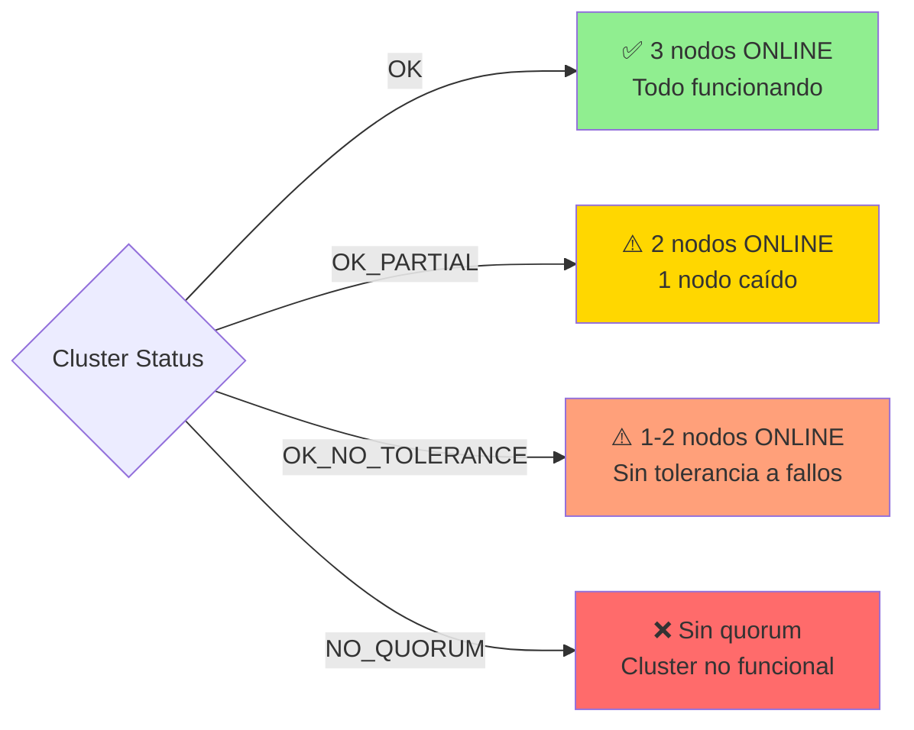

# 🔧 Guía de Operación

## Índice

1. [Comandos Diarios](#comandos-diarios)
2. [Monitoreo](#monitoreo)
3. [Troubleshooting](#troubleshooting)
4. [Escenarios de Prueba](#escenarios-de-prueba)
5. [Mantenimiento](#mantenimiento)
6. [Backup y Restore](#backup-y-restore)

---

## Comandos Diarios

### Iniciar/Detener Sistema

```bash
# Iniciar todos los servicios
docker-compose up -d

# Ver logs en tiempo real
docker-compose logs -f

# Detener todos los servicios
docker-compose down

# Detener y eliminar volúmenes (⚠️ BORRA TODO)
docker-compose down -v
```

### Ver Estado

```bash
# Estado de contenedores
docker-compose ps

# Logs de un servicio específico
docker-compose logs cluster-monitor
docker-compose logs mysql-router
docker-compose logs web

# Últimas 50 líneas
docker-compose logs --tail=50 cluster-monitor

# Seguir logs en tiempo real
docker-compose logs -f cluster-monitor
```

### Reiniciar Servicios

```bash
# Reiniciar un servicio
docker-compose restart mysql1
docker-compose restart mysql-router
docker-compose restart cluster-monitor

# Reiniciar todos los nodos MySQL
docker-compose restart mysql1 mysql2 mysql3

# Forzar recreación de un servicio
docker-compose up -d --force-recreate web
```

---

## Monitoreo

### Verificar Estado del Cluster

```bash
# Método 1: Desde MySQL Shell
docker exec mysql1 mysqlsh root:1234@localhost:3306 --js -e "dba.getCluster('myCluster').status()"

# Método 2: Formato JSON (más fácil de leer)
docker exec mysql1 mysqlsh root:1234@localhost:3306 --js -e "
var cluster = dba.getCluster('myCluster');
print(JSON.stringify(cluster.status(), null, 2));
"

# Método 3: Solo información básica
docker exec mysql1 mysqlsh root:1234@localhost:3306 --js -e "
var cluster = dba.getCluster('myCluster');
var status = cluster.status();
print('Status: ' + status.defaultReplicaSet.status);
print('PRIMARY: ' + status.defaultReplicaSet.primary);
"
```

#### Interpretar el Output



### Ver Nodos del Cluster

```bash
# Ver topología del cluster
docker exec mysql1 mysqlsh root:1234@localhost:3306 --js -e "
var cluster = dba.getCluster('myCluster');
var status = cluster.status();
var topology = status.defaultReplicaSet.topology;

for (var node in topology) {
  print(node + ' -> ' + topology[node].status + ' (' + topology[node].mode + ')');
}
"
```

### Verificar Replicación

```bash
# Ver GTIDs ejecutados en cada nodo
docker exec mysql1 mysql -uroot -p1234 -e "SELECT @@hostname, @@server_id, @@gtid_executed;"
docker exec mysql2 mysql -uroot -p1234 -e "SELECT @@hostname, @@server_id, @@gtid_executed;"
docker exec mysql3 mysql -uroot -p1234 -e "SELECT @@hostname, @@server_id, @@gtid_executed;"

# Ver información de Group Replication
docker exec mysql1 mysql -uroot -p1234 -e "
SELECT MEMBER_HOST, MEMBER_PORT, MEMBER_STATE, MEMBER_ROLE 
FROM performance_schema.replication_group_members;
"
```

### Verificar Aplicación Web

```bash
# Desde PowerShell
Invoke-WebRequest http://localhost:8091

# Ver qué servidor está usando
curl http://localhost:8091 | Select-String "Servidor Conectado"

# Desde Bash/Linux
curl -s http://localhost:8091 | grep "Servidor Conectado"
```

### Monitorear en Tiempo Real

```bash
# Watch del estado del cluster (actualiza cada 2s)
# PowerShell
while ($true) {
  Clear-Host
  docker exec mysql1 mysqlsh root:1234@localhost:3306 --js -e "dba.getCluster('myCluster').status()" 2>$null
  Start-Sleep -Seconds 2
}

# Bash/Linux
watch -n 2 'docker exec mysql1 mysqlsh root:1234@localhost:3306 --js -e "dba.getCluster(\047myCluster\047).status()" 2>/dev/null'
```

---

## Troubleshooting

### Problema: Cluster no inicia

**Síntomas**:
- `cluster-setup` se queda ejecutando sin completar
- Logs muestran errores de conexión

**Diagnóstico**:

```bash
# Ver logs de cluster-setup
docker-compose logs cluster-setup

# Ver logs de los nodos MySQL
docker-compose logs mysql1
docker-compose logs mysql2
docker-compose logs mysql3

# Verificar healthchecks
docker-compose ps
```

**Soluciones**:

```bash
# 1. Reiniciar desde cero
docker-compose down -v
docker-compose up -d

# 2. Verificar que los nodos estén healthy
docker-compose ps mysql1 mysql2 mysql3

# 3. Forzar recreación de cluster-setup
docker-compose up -d --force-recreate cluster-setup
```

### Problema: Un nodo no se une al cluster

**Síntomas**:
- Estado del nodo: `(MISSING)` o `OFFLINE`
- Monitor intenta rejoin pero falla

**Diagnóstico**:

```bash
# Ver estado del nodo
docker exec mysql2 mysql -uroot -p1234 -e "SELECT * FROM performance_schema.replication_group_members;"

# Ver errores de Group Replication
docker exec mysql2 mysql -uroot -p1234 -e "SHOW VARIABLES LIKE 'group_replication%';"

# Ver logs del monitor
docker-compose logs --tail=100 cluster-monitor
```

**Soluciones**:

```bash
# Opción 1: Reiniciar el nodo
docker-compose restart mysql2

# Opción 2: Rejoin manual
docker exec mysql1 mysqlsh root:1234@localhost:3306 --js -e "
var cluster = dba.getCluster('myCluster');
cluster.rejoinInstance('root:1234@mysql2:3306', {memberSslMode: 'REQUIRED'});
"

# Opción 3: Remover y añadir de nuevo
docker exec mysql1 mysqlsh root:1234@localhost:3306 --js -e "
var cluster = dba.getCluster('myCluster');
cluster.removeInstance('root:1234@mysql2:3306', {force: true});
cluster.addInstance('root:1234@mysql2:3306', {recoveryMethod: 'clone'});
"
```

### Problema: Router no conecta

**Síntomas**:
- Web app muestra error de conexión
- Router healthcheck fail

**Diagnóstico**:

```bash
# Ver logs del Router
docker-compose logs mysql-router

# Ver estado del Router
docker exec docker-mysql-router-1 ps aux

# Ver configuración del Router
docker exec docker-mysql-router-1 cat /work/mysqlrouter.conf
```

**Soluciones**:

```bash
# 1. Reiniciar Router
docker-compose restart mysql-router

# 2. Verificar state.json
docker exec docker-mysql-router-1 cat /work/data/state.json

# 3. Recrear bootstrap y router
docker-compose rm -sf router-bootstrap mysql-router
docker-compose up -d router-bootstrap
docker-compose up -d mysql-router
```

### Problema: Aplicación web no responde

**Diagnóstico**:

```bash
# Ver logs de web
docker-compose logs web

# Verificar conexión al Router
docker exec web curl -v http://mysql-router:6446

# Ver variables de entorno
docker exec web env | grep DB_
```

**Soluciones**:

```bash
# 1. Reiniciar web
docker-compose restart web

# 2. Verificar que Router esté healthy
docker-compose ps mysql-router

# 3. Probar conexión directa a MySQL
docker exec web mysql -h mysql-router -P 6446 -uapp -p1234 appdb -e "SELECT 1;"
```

### Problema: Cluster con NO_QUORUM

**Síntomas**:
- Cluster status: `NO_QUORUM`
- No se pueden hacer escrituras

**Diagnóstico**:

```bash
# Ver cuántos nodos están ONLINE
docker exec mysql1 mysqlsh root:1234@localhost:3306 --js -e "
var cluster = dba.getCluster('myCluster');
print(JSON.stringify(cluster.status().defaultReplicaSet.topology, null, 2));
"
```

**Soluciones**:

```bash
# Opción 1: Forzar quorum en el nodo online
docker exec mysql1 mysqlsh root:1234@localhost:3306 --js -e "
var cluster = dba.getCluster('myCluster');
cluster.forceQuorumUsingPartitionOf('mysql1:3306');
"

# Opción 2: Dejar que el monitor lo detecte
# El monitor forzará el quorum automáticamente en 10 segundos

# Opción 3: Reboot manual
docker exec mysql1 mysqlsh root:1234@localhost:3306 --js -e "
dba.rebootClusterFromCompleteOutage('myCluster', {force: true});
"
```

---

## Escenarios de Prueba

### Prueba 1: Failover de PRIMARY

```bash
# 1. Ver PRIMARY actual
docker exec mysql1 mysqlsh root:1234@localhost:3306 --js -e "
print(dba.getCluster('myCluster').status().defaultReplicaSet.primary);
"

# 2. Detener el PRIMARY (asumiendo que es mysql1)
docker-compose stop mysql1

# 3. Esperar 20 segundos

# 4. Verificar que mysql2 o mysql3 sea PRIMARY ahora
docker exec mysql2 mysqlsh root:1234@localhost:3306 --js -e "
print(dba.getCluster('myCluster').status().defaultReplicaSet.primary);
"

# 5. Verificar que la app sigue funcionando
curl http://localhost:8091

# 6. Reiniciar mysql1
docker-compose start mysql1

# 7. Ver que mysql1 se une como SECONDARY
# Esperar 30 segundos
docker exec mysql1 mysqlsh root:1234@localhost:3306 --js -e "
dba.getCluster('myCluster').status();
"
```

### Prueba 2: Operación con 1 Solo Nodo

```bash
# 1. Detener 2 nodos
docker-compose stop mysql2 mysql3

# 2. Esperar 40 segundos

# 3. Ver logs del monitor
docker-compose logs --tail=50 cluster-monitor

# 4. Verificar estado (debe estar OK_NO_TOLERANCE o similar)
docker exec mysql1 mysqlsh root:1234@localhost:3306 --js -e "
print(dba.getCluster('myCluster').status().defaultReplicaSet.status);
"

# 5. Probar la aplicación
curl http://localhost:8091

# 6. Iniciar los otros nodos gradualmente
docker-compose start mysql2
# Esperar 30s
docker-compose start mysql3
# Esperar 30s

# 7. Verificar que todos estén ONLINE
docker exec mysql1 mysqlsh root:1234@localhost:3306 --js -e "
dba.getCluster('myCluster').status();
"
```

### Prueba 3: Recovery desde Outage Completo

```bash
# 1. Detener TODOS los nodos
docker-compose stop mysql1 mysql2 mysql3

# 2. Esperar 30 segundos

# 3. Iniciar UN SOLO nodo (cualquiera)
docker-compose start mysql3

# 4. Ver logs del monitor (debe detectar 1 nodo y hacer recovery)
docker-compose logs -f cluster-monitor

# 5. Esperar 60 segundos

# 6. Verificar estado
docker exec mysql3 mysqlsh root:1234@localhost:3306 --js -e "
dba.getCluster('myCluster').status();
"

# 7. Verificar que la app funciona
curl http://localhost:8091

# 8. Iniciar los demás nodos
docker-compose start mysql1 mysql2
```

### Script de Pruebas Automatizado

Usar el script PowerShell incluido:

```powershell
.\test-cluster.ps1
```

Menú interactivo con opciones:
1. Prueba de failover
2. Prueba de 1 solo nodo
3. Prueba de recuperación gradual
4. Ver estado del cluster
5. Ver logs
6. Reiniciar cluster
7. Probar app
8. Stress test

---

## Mantenimiento

### Actualizar Datos

```bash
# Insertar datos adicionales
docker exec -i mysql1 mysql -uroot -p1234 appdb < mysql/insert-additional-data.sql

# O conectarse interactivamente
docker exec -it mysql1 mysql -uroot -p1234 appdb
```

### Limpiar Logs

```bash
# Docker limpia logs automáticamente, pero puedes forzar
docker-compose down
docker system prune -af
docker volume prune -f  # ⚠️ Borra volúmenes no usados
```

### Actualizar Configuración

```bash
# Después de modificar docker-compose.yml
docker-compose up -d --force-recreate

# Solo servicios específicos
docker-compose up -d --force-recreate cluster-monitor
```

### Verificar Uso de Recursos

```bash
# Ver uso de CPU/memoria
docker stats

# Ver espacio de volúmenes
docker volume ls
docker system df -v
```

---

## Backup y Restore

### Backup Completo

```bash
# Backup de todos los datos del cluster
docker exec mysql1 mysqldump -uroot -p1234 --all-databases --single-transaction --triggers --routines --events > backup_$(date +%Y%m%d_%H%M%S).sql

# Solo la base de datos de la app
docker exec mysql1 mysqldump -uroot -p1234 appdb > backup_appdb_$(date +%Y%m%d_%H%M%S).sql

# Con gzip para comprimir
docker exec mysql1 mysqldump -uroot -p1234 --all-databases | gzip > backup_$(date +%Y%m%d_%H%M%S).sql.gz
```

### Restore

```bash
# Restore completo
docker exec -i mysql1 mysql -uroot -p1234 < backup_20241105_120000.sql

# Restore de appdb específicamente
docker exec -i mysql1 mysql -uroot -p1234 appdb < backup_appdb_20241105_120000.sql

# Desde archivo comprimido
gunzip < backup_20241105_120000.sql.gz | docker exec -i mysql1 mysql -uroot -p1234
```

### Backup de Volúmenes Docker

```bash
# Backup de volúmenes
docker run --rm -v docker_mysql1-data:/data -v $(pwd):/backup ubuntu tar czf /backup/mysql1-data_$(date +%Y%m%d).tar.gz /data

# Restore de volúmenes
docker run --rm -v docker_mysql1-data:/data -v $(pwd):/backup ubuntu tar xzf /backup/mysql1-data_20241105.tar.gz -C /
```

---

## Comandos Útiles Adicionales

### Ver Configuración del Cluster

```bash
# Ver opciones del cluster
docker exec mysql1 mysqlsh root:1234@localhost:3306 --js -e "
var cluster = dba.getCluster('myCluster');
print(JSON.stringify(cluster.options(), null, 2));
"

# Ver peso de los nodos
docker exec mysql1 mysqlsh root:1234@localhost:3306 --js -e "
var cluster = dba.getCluster('myCluster');
var status = cluster.status();
for (var node in status.defaultReplicaSet.topology) {
  print(node + ' weight: ' + status.defaultReplicaSet.topology[node].memberWeight);
}
"
```

### Cambiar PRIMARY Manualmente

```bash
# Cambiar PRIMARY a mysql2
docker exec mysql1 mysqlsh root:1234@localhost:3306 --js -e "
var cluster = dba.getCluster('myCluster');
cluster.setPrimaryInstance('mysql2:3306');
"
```

### Ver Variables de Group Replication

```bash
# Ver todas las variables de GR
docker exec mysql1 mysql -uroot -p1234 -e "SHOW VARIABLES LIKE 'group_replication%';"

# Variables específicas
docker exec mysql1 mysql -uroot -p1234 -e "
SELECT @@group_replication_group_name,
       @@group_replication_local_address,
       @@group_replication_group_seeds,
       @@group_replication_single_primary_mode;
"
```

### Ejecutar Query en todos los nodos

```bash
# PowerShell
@('mysql1', 'mysql2', 'mysql3') | ForEach-Object {
  Write-Host "`n=== $_ ===" -ForegroundColor Cyan
  docker exec $_ mysql -uroot -p1234 -e "SELECT @@hostname, @@server_id, COUNT(*) as num_empleados FROM appdb.empleados;"
}

# Bash
for node in mysql1 mysql2 mysql3; do
  echo "=== $node ==="
  docker exec $node mysql -uroot -p1234 -e "SELECT @@hostname, @@server_id, COUNT(*) as num_empleados FROM appdb.empleados;"
done
```

---

## Tabla de Referencia Rápida

| Comando | Descripción |
|---------|-------------|
| `docker-compose up -d` | Iniciar todo |
| `docker-compose down` | Detener todo |
| `docker-compose ps` | Ver estado |
| `docker-compose logs -f [servicio]` | Ver logs |
| `docker-compose restart [servicio]` | Reiniciar servicio |
| `docker exec mysql1 mysqlsh root:1234@localhost:3306 --js -e "dba.getCluster('myCluster').status()"` | Ver estado del cluster |
| `curl http://localhost:8091` | Probar app web |
| `.\test-cluster.ps1` | Script de pruebas |

---

## Checklist de Operación Diaria

- [ ] Ver estado de contenedores: `docker-compose ps`
- [ ] Verificar cluster status: Ver que esté `OK`
- [ ] Revisar logs del monitor: No debe haber errores críticos
- [ ] Probar aplicación web: Debe cargar correctamente
- [ ] Verificar que hay 3 nodos ONLINE
- [ ] Revisar PRIMARY actual: Debe ser mysql1 preferentemente

---

[← Código](CODIGO.md) | [Volver al README](README.md)
